# Agentic Workflow

## Overview

This repository now includes an end-to-end Q4 workflow that explicitly decomposes the project into specialized agents instead of using one monolithic prompt. Each agent has a typed input contract, a typed output contract, and durable artifact handoffs that can be inspected in both the backend traces and the frontend workflow page.

## Mermaid Diagram

```mermaid
flowchart LR
    A["DataCurationAgent\n(Q1 raw + processed artifacts)"]
    B["RetrievalAgent\n(Q2 evidence retrieval)"]
    C["VisualUnderstandingAgent\n(Q2 visual profile synthesis)"]
    D["PromptComposerAgent\n(Q3 prompt planning)"]
    E["ImageGenerationAgent\n(Q3 dual-model generation)"]
    F["EvaluationAgent\n(Q3 comparison + analytics)"]

    A -->|"processed corpus + Q1 validation"| B
    B -->|"retrieval evidence + llm trace"| C
    C -->|"baseline + review-informed profiles"| D
    D -->|"pilot/final prompt plan"| E
    E -->|"generation manifests + images"| F
```

## Agent Roles

- `DataCurationAgent`
  - Verifies raw scrape artifacts.
  - Rebuilds the processed corpus only when missing or explicitly refreshed.
  - Re-checks strict Q1 validity before downstream stages continue.

- `RetrievalAgent`
  - Reuses or builds the `review_informed_rag` retrieval evidence layer.
  - Preserves aspect-specific evidence snippets and LLM trace artifacts.

- `VisualUnderstandingAgent`
  - Ensures both `baseline_description_only` and `review_informed_rag` visual profiles exist.
  - Produces the structured `VisualProfile` outputs used by downstream prompt composition.

- `PromptComposerAgent`
  - Reads the saved visual profiles and prompt templates.
  - Surfaces inspectable pilot and final prompt previews or reuses saved prompt versions.

- `ImageGenerationAgent`
  - Reuses or generates OpenAI and Stability image outputs.
  - Preserves prompt lineage through generation manifests and prompt version files.

- `EvaluationAgent`
  - Reuses or generates comparison panels, human scoring sheets, and optional vision-assisted evaluation outputs.
  - Feeds frontend analytics and report-ready evaluation artifacts.

## Why This Is Agentic

This workflow is agentic rather than one monolithic prompt because:

- each stage has a specialized responsibility and a typed contract
- each stage decides whether to reuse or recompute downstream artifacts
- each handoff is durable and inspectable on disk
- later stages depend on explicit upstream artifacts, not hidden prompt state
- the frontend can visualize execution traces, stage status, and artifact transitions for presentation and reporting

## Trace Artifacts

Every workflow run writes:

- `outputs/workflow_runs/<run_id>/trace.json`
- `outputs/workflow_runs/<run_id>/stage_status.json`
- `outputs/workflow_runs/<run_id>/artifact_links.json`

These files are the main source for the animated workflow page in the frontend.
